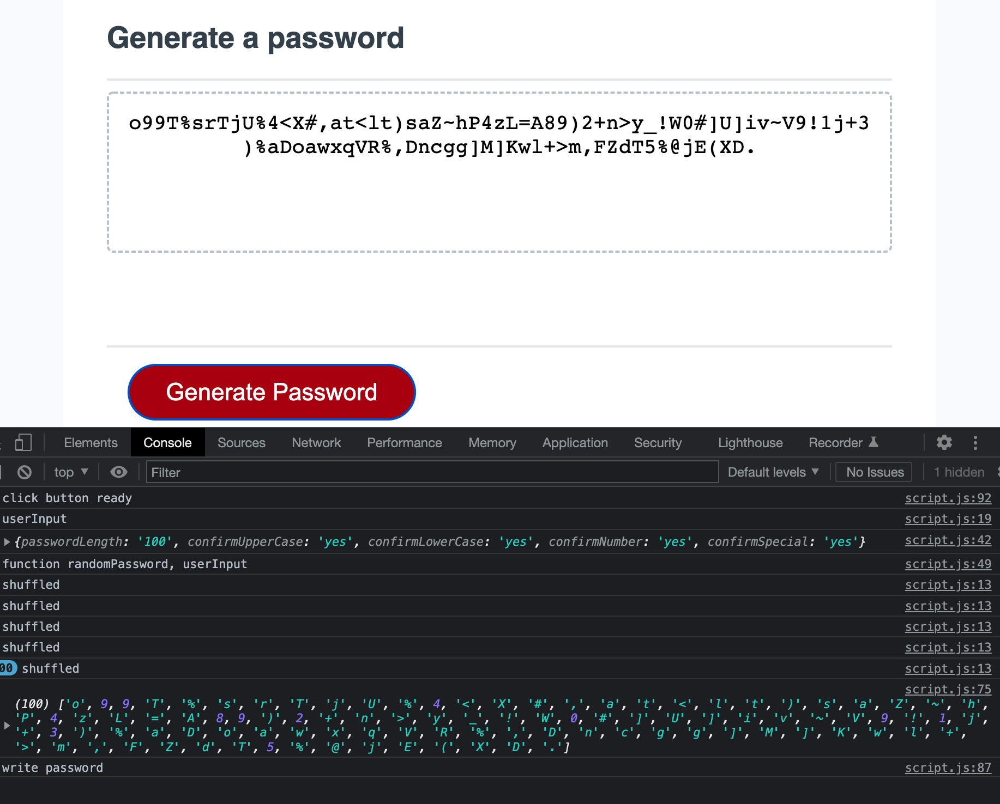

# password-generator

Given some basic starting code, I built the functionality of the password  
generator through adding code to the javascript.
 
I started by quoting out the steps needed to achieve the targets outlined in  
the original unsolved README.md 
 

# Issues to tackle:

1. setting up arrays for upper case, lower case, numbers, and special characters  
   [event listener "click" was already established in the code.]
2. setting up input for length of password
3. setting up prompts to use or not use each attribute
4. must choose at least 1 type 
    - still tackling when if any/all character type is not wanted
5. display password

# challenges

Getting the code to run through all the various functions is getting more intricate; learning when to concatinate and how to manage multiple arrays has been the biggest issue. With that, getting to the end of the code to allow the text to appear on the screen became the next biggest issue.

# collaboration

I worked with Alli Brodine and Ahmad Hanif on setting up the steps and possible angles of attack (we had all started in fairly different directions.) I also spent some office hours time with Chris Pesar who helped me understand how some of the functions worked off each other.

Now that I have found basic functionality in the easiest code run, I need to come back and add the "false" logic to the user choices for full-funtionality.

# Published URL

https://bekind-rewind.github.io/password-generator/

# Screenshot

